# Enterprise OTel Observability Stack

> [!IMPORTANT]
> **Current Status:** Phase 1 (Local) is **Complete**. Phase 2 (AWS) is **In Progress** (Step 13 — Validation). All three ECS services (Grafana, Loki, App+ADOT) are live in AWS.

A production-grade, end-to-end observability platform for containerised applications using **OpenTelemetry** as the unified telemetry layer. Infrastructure, configuration, and dashboards are all managed as code.

## What This Is

This project demonstrates the three pillars of observability — **Metrics, Logs, and Traces** — wired together in a single, coherent pipeline:

- A **FastAPI** app instrumented with the OTel SDK emits all telemetry via OTLP
- **ADOT** (AWS Distro for OpenTelemetry) collects and routes everything
- **Prometheus / AMP** stores metrics, **Loki** stores logs, **X-Ray** stores traces
- **Grafana** visualises all three, with Log-to-Trace correlation

A **Locust** load generator and background metric/log emitters ensure the dashboards are always live — no manual traffic needed.

## Dashboards

### Overview Dashboard
The Overview dashboard provides a high-level view of the system health, including metric-based request rates and simulated user counts alongside live Loki log streams.


### Log-to-Trace Correlation
Expanding a log line in Loki reveals structured metadata, including the TraceID. This is linked natively to AWS X-Ray, allowing for seamless navigation to the waterfall view.


## High-Level Architecture

```mermaid
flowchart TD
    LT["🦗 Locust<br/>Load Testing"]

    subgraph APP["Application Layer"]
        FA["🐍 FastAPI App<br/>OpenTelemetry SDK"]
    end

    subgraph ADOT["Collection Layer — ADOT Collector"]
        R["Receiver: OTLP"]
        P["Processors: batch · resource"]
        E["Exporters: Prometheus remote_write · Loki HTTP · X-Ray"]
        R --> P --> E
    end

    subgraph BACKENDS["Backend Storage"]
        M["📊 Metrics<br/>Prometheus · AMP"]
        L["📄 Logs<br/>Loki + MinIO · Loki + S3"]
        T["🔍 Traces<br/>X-Ray Daemon · AWS X-Ray"]
    end

    subgraph VIZ["Visualization"]
        G["📈 Grafana OSS<br/>Dashboards as Code"]
    end

    LT -->|HTTP traffic| FA
    FA -->|OTLP gRPC| R
    E -->|remote_write| M
    E -->|HTTP| L
    E -->|UDP/TCP| T
    M --> G
    L --> G
    T --> G
```



## AWS Architecture


## Stack


| Feature / Signal | Local (All Containers) | AWS Production (ECS + Managed) | Type in AWS |
| :--- | :--- | :--- | :--- |
| **Application** | `app` | `app` | **ECS Container** |
| **Telemetry Collector** | `adot` (Standalone) | `adot` (Sidecar) | **ECS Container** |
| **Metrics Storage** | `prometheus` | **Amazon Managed Prometheus (AMP)** | **Managed Service** |
| **Log Database** | `loki` | `loki` | **ECS Container** |
| **Log Storage (Object)** | `minio` (S3 Simulator) | **Amazon S3** | **Managed Service** |
| **Trace Storage** | `xray-daemon` | **AWS X-Ray** | **Managed Service** |
| **Visualization** | `grafana` | `grafana` | **ECS Container** |
| **Load Generator** | `locust` | `locust` | **ECS Container** |
| **Traffic Direction** | Network Bridge | **Application Load Balancer (ALB)** | **Managed Service** |
| **Secrets / Config** | `.env` file | **SSM Parameter Store** | **Managed Service** |
| **IaC** | — | **Terraform** | **Tooling** |
| **CI/CD** | — | **GitHub Actions** | **Tooling** |


## Implementation Strategy

**Local first, then AWS.** The Docker Compose stack is a faithful simulation of the AWS architecture — same ADOT config, same Grafana dashboards, same app code. Moving to AWS is a config swap, not a rewrite.

```
Phase 1 (Local)  →  prove the pipeline works on Docker Desktop
Phase 2 (AWS)    →  use Terraform to replicate the same pipes in the cloud
```

## Estimated AWS Cost

~$30/month for an always-on demo setup. Drops to ~$0 with `terraform destroy` between sessions (Terraform state persists in S3 for <$1/month).

## Repository Structure

```
.
├── app/                            # FastAPI app + OTel instrumentation
├── adot/                           # ADOT collector config (config.yaml)
├── grafana/
│   ├── provisioning/               # Grafana datasource and dashboard provisioning
│   │   ├── datasources/            # Grafana datasource provisioning
│   │   └── dashboards/             # Grafana dashboard provisioning
│   └── dashboard-definitions/      # Dashboard JSON files
├── locust/                         # Load test scripts
├── terraform/                      # All IaC — ECS, AMP, S3, IAM (Phase 2)
├── .github/workflows/              # CI/CD pipeline (Phase 2)
├── docker-compose.yml              # Tech Stack (all 7 services)
├── prometheus.yml                  # Prometheus scrape config
├── loki-config.yaml                # Loki storage config (MinIO/S3 backend)
├── .env                            # Local env values (gitignored)
├── docs/                           
│   ├── ARCHITECTURE.md             # Full architecture + ADRs + cost breakdown
│   └── IMPLEMENTATION_PLAN.md      # Step-by-step build checklist
├── AGENTS.md                       # Agent instructions and conventions
└── README.md                       # This file
```

## Docs

- [`docs/ARCHITECTURE.md`](./docs/ARCHITECTURE.md) — Full architecture diagram, component decisions (ADRs), Phase 1 → Phase 2 migration guide, and cost breakdown
- [`AGENTS.md`](./AGENTS.md) — Agent instructions, architecture rules, and per-phase conventions
- [`docs/IMPLEMENTATION_PLAN.md`](./docs/IMPLEMENTATION_PLAN.md) — Step-by-step build checklist for Phase 1 (local) and Phase 2 (AWS)
