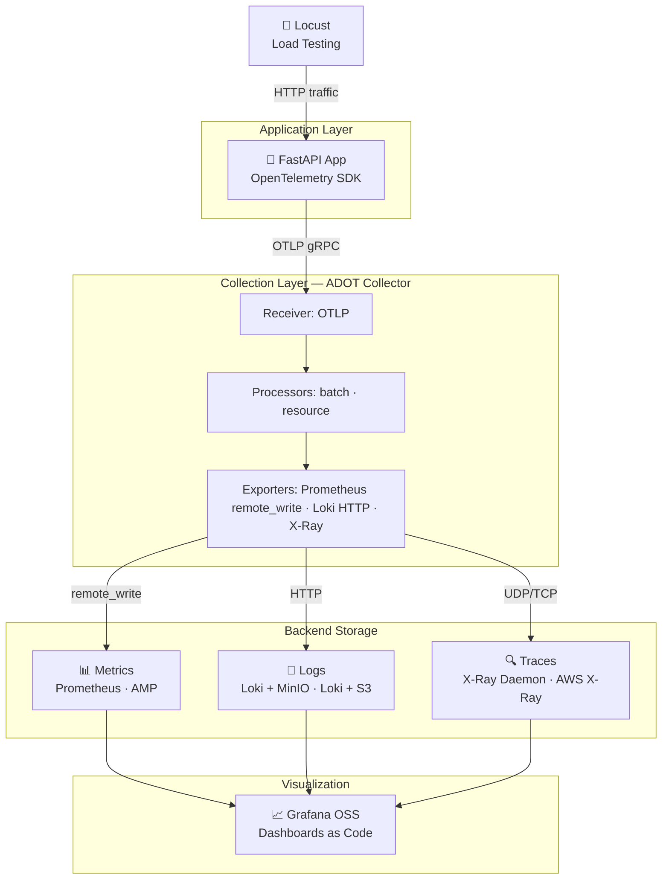

# Enterprise OTel Observability Stack — Architecture & Design Decisions

## 1. High-Level Objective

Build a stateless, consolidated observability architecture for a containerized Python application using a unified telemetry collection layer (OpenTelemetry). The entire lifecycle — infrastructure, configuration, and dashboards — is managed via GitOps (GitHub Actions + Terraform).

---

## 2. Architecture Overview

---

## 3. Component Stack

### Phase 1: Local (Docker Compose)

| Component | Technology | Purpose |
|---|---|---|
| Application | FastAPI + OTel SDK | Emits OTLP telemetry |
| Collector | ADOT (Docker) | Unified telemetry pipeline |
| Metrics | Prometheus (container) | Metrics storage |
| Logs | Loki (container) + MinIO | Log storage (MinIO simulates S3) |
| Traces | `amazon/aws-xray-daemon` (container) | Receives traces from ADOT |
| Visualization | Grafana OSS (container) | Dashboards |
| Load Testing | Locust (container) | Traffic simulation |

### Phase 2: AWS (Production)

| Component | Technology | Notes |
|---|---|---|
| Application | ECS Fargate Task | Same container image as local |
| Collector | ADOT Sidecar on ECS | Same config, different endpoints |
| Metrics | Amazon Managed Prometheus (AMP) | Drop-in replacement for Prometheus |
| Logs | Loki on ECS + Amazon S3 | TSDB ship mode with real S3 |
| Traces | AWS X-Ray (managed) | No infra to run; ADOT exports natively |
| Visualization | Grafana OSS on ECS | Same dashboards as local |
| IaC | Terraform | All AWS resources |
| CI/CD | GitHub Actions | Build → ECR push → `terraform apply` |
| TF State | S3 bucket + DynamoDB | Remote state with locking |

---

## 4. Design Decisions

### ADR-001: ADOT as the Unified Collector
- **Decision:** Use AWS Distro for OpenTelemetry (ADOT) as the single collector for all telemetry signals.
- **Rationale:** ADOT is the AWS-supported distribution of the OTel Collector. It has native exporters for AMP, X-Ray, and Loki, meaning the application only needs to speak OTLP. It is the abstraction layer that makes Phase 1 → Phase 2 migration low-friction — only endpoint URLs in the ADOT config change, not app code.
- **Rejected:** Running separate agents per signal (e.g., Prometheus Node Exporter, Fluent Bit) as it increases operational complexity.

### ADR-002: AWS X-Ray for Distributed Tracing
- **Decision:** Use AWS X-Ray as the trace backend.
- **Rationale:** X-Ray is a fully managed service requiring zero infrastructure to operate. ADOT has first-class X-Ray export support. For local development, the `aws-xray-daemon` Docker container provides a compatible endpoint. The AWS-managed service replaces the daemon in production — nothing new to deploy.
- **Rejected:** Grafana Tempo — while it provides a more unified Grafana experience and TraceQL, it requires running and managing an additional ECS service in AWS, increasing operational complexity.

### ADR-003: Grafana OSS on ECS (not Amazon Managed Grafana)
- **Decision:** Run Grafana OSS as a container (locally and on ECS).
- **Rationale:** Amazon Managed Grafana (AMG) mandates AWS IAM Identity Center (SSO) for all user authentication. This is a non-trivial prerequisite that adds setup overhead unrelated to the observability goal. Grafana OSS avoids this, provides identical dashboard/JSON functionality, and is fully portable between local and AWS.
- **Rejected:** AMG — too much auth overhead for a project where the value is in the telemetry pipeline, not the Grafana management layer.

### ADR-004: Terraform Remote State (S3 + DynamoDB)
- **Decision:** Use S3 for Terraform state storage and DynamoDB for state locking.
- **Rationale:** A GitOps CI/CD pipeline (`terraform apply`) requires a remote, shared state backend. Local state is incompatible with automated pipelines. DynamoDB locking prevents concurrent applies from corrupting state.
- **Rejected:** Terraform Cloud — adds an external dependency with its own auth requirements.

### ADR-005: SSM Parameter Store for Secrets
- **Decision:** Store all credentials and sensitive config (AMP endpoint, Loki endpoint, Grafana API key) in AWS SSM Parameter Store.
- **Rationale:** SSM Parameter Store is free for standard parameters, natively integrated with ECS Task Definitions (inject as environment variables), and sufficient for this use case.
- **Rejected:** AWS Secrets Manager — costs $0.40/secret/month; the additional rotation and cross-account features are unnecessary here.

### ADR-006: Local-First Development Strategy
- **Decision:** Build and validate the full stack locally on Docker Desktop before deploying any AWS resources.
- **Rationale:** Proves the telemetry pipeline works end-to-end before introducing cloud cost and IAM complexity. Locust → ADOT → Prometheus → Grafana must show real chart spikes on localhost first. The Phase 1 local stack is a faithful simulation of Phase 2 (same configs, same images, swapped endpoints), not a throwaway prototype.

### ADR-007: ECS Fargate for Compute
- **Decision:** Use Amazon ECS with the Fargate launch type for all container workloads.
- **Rationale:** Fargate provides serverless compute for containers, eliminating the need to provision, patch, or scale underlying EC2 instances. It offers a near 1:1 mapping from our local `docker-compose.yml` services to AWS Task Definitions. It also natively supports the ADOT sidecar pattern, allowing the app and collector to run tightly coupled.
- **Rejected:** EC2 (requires managing servers and AMIs), EKS/Kubernetes (adds immense operational and networking complexity unnecessary for a core observability demonstration).

### ADR-008: Raw Terraform vs Modules for Core Infra
- **Decision:** Use official modules for networking (VPC), but raw Terraform `resource` blocks for Compute (ECS), Storage (ECR), and Security (IAM/SGs).
- **Rationale:** The AWS VPC module abstracts away hundreds of lines of error-prone routing boilerplate. However, for ECS and IAM, writing raw resources ensures complete transparency and strict adherence to least-privilege security. Massive external ECS modules often overcomplicate serverless Fargate deployments and obscure IAM role permissions.

---

## 5. What Changes Between Phase 1 and Phase 2

| Item | Phase 1 (Local) | Phase 2 (AWS) | Effort |
|---|---|---|---|
| App code | ✅ Same | ✅ Same | None |
| OTel instrumentation | ✅ Same | ✅ Same | None |
| Grafana dashboard JSON | ✅ Same | ✅ Same | None |
| Locust scripts | ✅ Same | ✅ Same | None |
| ADOT `config.yaml` | localhost endpoints | AMP/Loki/X-Ray URLs | Config only |
| Grafana datasources | localhost URLs | ECS service URLs | Config only |
| Infra | `docker-compose.yml` | Terraform + ECS | New work |
| CI/CD | None | GitHub Actions | New work |

---

## 6. Data Simulation ("Living Demo")

The stack must always have live data to demonstrate. Mechanisms:

- **Locust** — Continuously hammers the API with varying concurrency to create traffic spikes visible in Prometheus dashboards.
- **Custom OTel Gauges** — The app emits `active_simulated_users` and similar custom metrics via the OTel SDK, ensuring metric flow even without Locust.
- **Background Log Generator** — A background thread in the app emits a mix of `INFO`, `WARNING`, and `ERROR` log records to exercise Loki filtering and alerting.
- **`/crash` endpoint** — Deliberately triggers a 500 error and stack trace to demonstrate Log-to-Trace correlation in Grafana (matching an error log to its trace span).

---

## 7. Implementation Phases

### Phase 1 — Local Validation
1. `docker-compose.yml` with all 7 services (App, ADOT, Prometheus, Loki, MinIO, X-Ray Daemon, Grafana)
2. FastAPI app with OTel SDK instrumentation (metrics, logs, traces)
3. ADOT collector config (`config.yaml`) routing to local backends
4. Grafana provisioned with datasources and dashboards as code
5. Locust script + `/crash` endpoint + background log generator
6. **Goal:** Locust traffic creates a visible spike on a Grafana chart on localhost

### Phase 2 — AWS Deployment
1. Terraform: S3 + DynamoDB for state backend (prerequisite)
2. Terraform: VPC, ECS Cluster, ECR, IAM roles
3. Terraform: AMP workspace, S3 bucket for Loki
4. Terraform: ECS Services — App+ADOT sidecar, Loki, Grafana
5. Terraform: Grafana dashboards deployed via Grafana API / JSON provisioning
6. GitHub Actions: Build → ECR push → `terraform apply`

---

## 8. Cost Estimates

### Phase 1 — Local (Docker Compose)
**$0/month.** Runs entirely on Docker Desktop. No AWS services are used.

### Phase 2 — AWS (ap-southeast-2 / Sydney, demo/dev workload)

> [!NOTE]
> Estimates assume low-volume demo traffic (Locust + background generators). Not sized for production scale.

| Service | What it does | Est. Monthly Cost |
|---|---|---|
| **ECS Fargate — App + ADOT sidecar** | 0.25 vCPU / 0.5 GB, always-on | ~$7 |
| **ECS Fargate — Loki** | 0.25 vCPU / 0.5 GB, always-on | ~$7 |
| **ECS Fargate — Grafana OSS** | 0.25 vCPU / 0.5 GB, always-on | ~$7 |
| **Amazon Managed Prometheus (AMP)** | ~1M metric samples/day ingest | ~$3 |
| **Amazon S3** | Loki chunk storage, TF state | ~$1 |
| **AWS X-Ray** | First 100K traces/month free | $0 |
| **ECR** | Container image storage (<1 GB) | $0 |
| **DynamoDB** | TF state lock (free tier) | $0 |
| **SSM Parameter Store** | Secrets (standard tier, free) | $0 |
| **NAT Gateway / Data Transfer** | Outbound traffic from VPC | ~$5 |
| | **Total estimate** | **~$30/month** |

### Cost Optimisation Options

- **Tear down when not in use** — `terraform destroy` between sessions drops cost to ~$0 (S3/DynamoDB persist state for <$1). This is practical for demo/portfolio use.
- **Fargate Spot** — Reduces ECS compute cost by up to 70% for non-critical services (Loki, Grafana).
- **AMP free tier** — First 2 billion metric samples/month are free for the first 3 months on new accounts.
